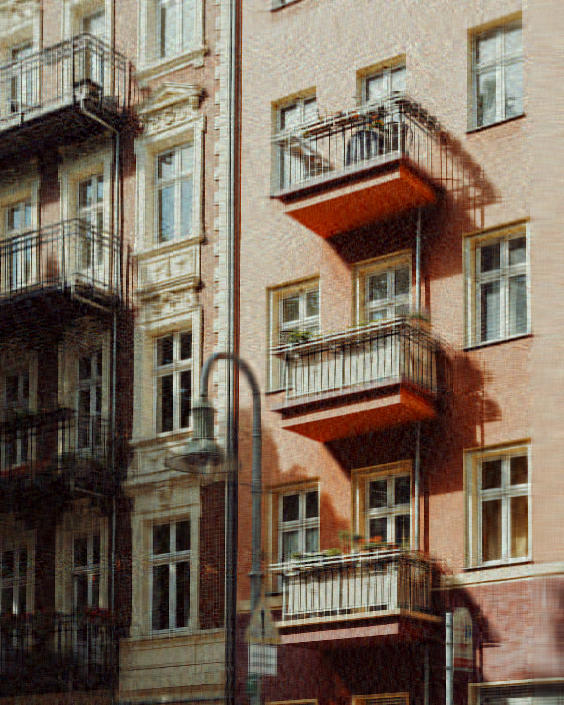

# SVD Image Compression

The goal of this work is to compare different implementations of [SVD](https://en.wikipedia.org/wiki/Singular_value_decomposition) for image compression.

## `imsvd` tool

Simple image compression tool `imsvd` was implemented for the task. 
It accepts an image and a compression ratio and outputs a compressed image in a special format. 
It's then possible to decompress an image using the tool.

### Format

Compressed image is stored in a special format that's represented in binary as following:

| Size (bytes)                       | Description                                                                |
|------------------------------------|----------------------------------------------------------------------------|
| 5                                  | `IMSVD` in `ASCII` representing the format                                 |
| 4                                  | Height of an image (`LE int32`)                                            |
| 4                                  | Width of an image (`LE int32`)                                             |
| 4                                  | Number `k` of singular values used for the approximation (`LE int32`)      |
| 4 * `k` * (`height` + `width` + 1) | SVD representation of `R` channel stored as 3 matrices of `float32` values |
| 4 * `k` * (`height` + `width` + 1) | SVD representation of `G` channel stored as 3 matrices of `float32` values |
| 4 * `k` * (`height` + `width` + 1) | SVD representation of `B` channel stored as 3 matrices of `float32` values |

## Compression results

The tools supports 3 SVD implementations:
- [The one provided by numpy](https://numpy.org/doc/1.26/reference/generated/numpy.linalg.svd.html)
- [Power method](https://cs.yale.edu/homes/el327/datamining2013aFiles/07_singular_value_decomposition.pdf)
- [Block Power Method](https://emis.de/journals/ASUO/mathematics_/anale2015vol2/Bentbib_A.H.__Kanber_A..pdf)

To compare them 3 images were chosen:
- image of a [sky with little colors and smooth transitions between them](images/sky.png)
- image of an [Eiffel Tower at night with sharp transitions between colors](images/tower.png)
- image of a [house with lots of colors and details](images/house.png)

All images were compressed 2x in file size. Results are as following:

| Original                    | Numpy                                 | Block power                           | Power                                 |
| --------------------------- | ------------------------------------- | ------------------------------------- | ------------------------------------- |
|  |  |  |  |

| Original                        | Numpy                                     | Block power                               | Power                                     |
| ------------------------------- | ----------------------------------------- | ----------------------------------------- | ----------------------------------------- |
|  |  |  |  |

| Original                        | Numpy                                     | Block power                               | Power                                     |
| ------------------------------- | ----------------------------------------- | ----------------------------------------- | ----------------------------------------- |
|  |  |  |  |
 

- It can be seen that on the image of a sky all 3 implementations perform similarly. 
The resulting pitctures are hard to differentiate with the human eye
though it can be noted that `Numpy` and `Block power` managed to preserve the original shape of the moon better than `Power`.

- On the picture of a tower `Numpy` and `Block power` produce nearly identical results. 
`Power` however introduces a lot of colored noise to the image making it generally hard to differentiate objects.
Despite that `Power` can sometimes preserve more details than other implementations as can be seen on a crosswalk in the lower half of the image.

- On the picture of a house `Numpy` and `Block power` again produce nearly identical results while `Power` adds a lot of colored noise.

## Summary

- On an image with little amount of colors and smooth transitions between them all 3 implementations perform similarly.
- On images with lots of colors `Numpy` and `Block power` produce nearly identical results
while `Power` introduces a lot of colored noise making it hard to differentiate objects.
- Sometimes `Power` can preserve more details than other implementations but amount of noise it produces outweighs this advantage.
